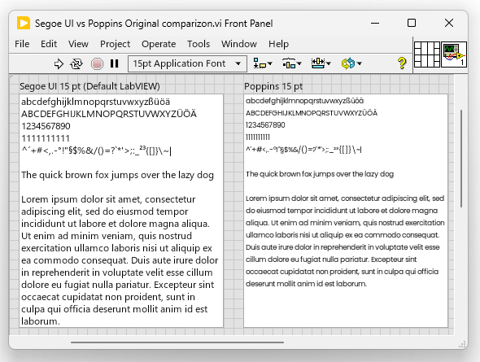
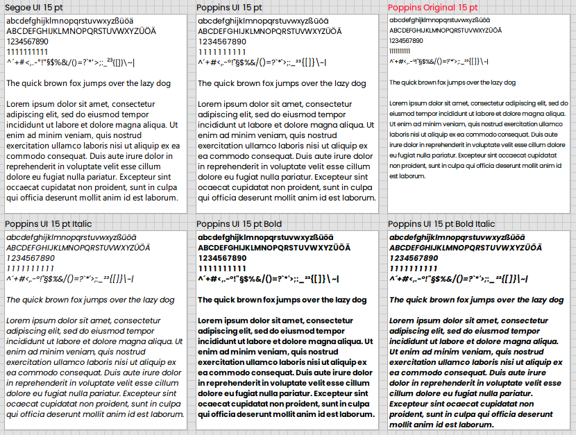

# Poppins UI
Modified Poppins Font, especially to be compatible with LabVIEW.
## Problem Statement
When compared with Segoe UI (which is default LabVIEW Font for GUI), the original Poppins appeared too small (same size used for both):

The primary goal of the modification is to "synchronize" sizes and appearance of both fonts.

### Poppins UI Modification:

## Poppins Original

During the 1920s, Central European type foundries joined the modernists movements in art and design. Modernism was truly international in scope; only three years after the founding of the German Bauhaus school, several of its painting instructors were already exhibiting their work in Calcutta.

Geometric sans serif typefaces have been a popular design element ever since these actors took to the world’s stage. Poppins is one of the newest comer to this long tradition...
